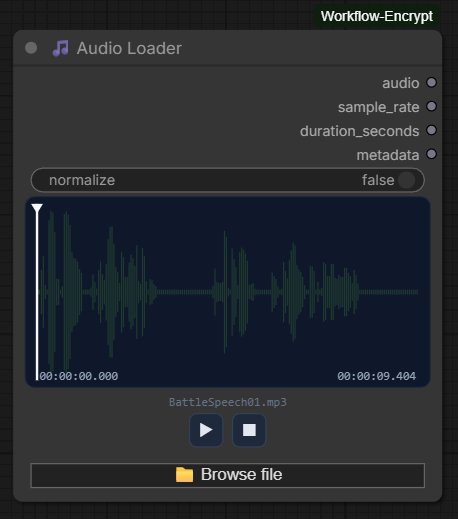
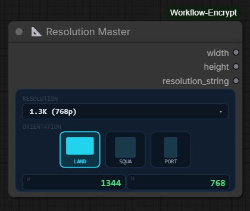
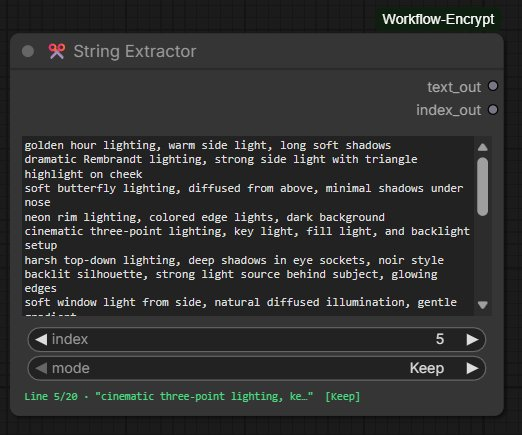
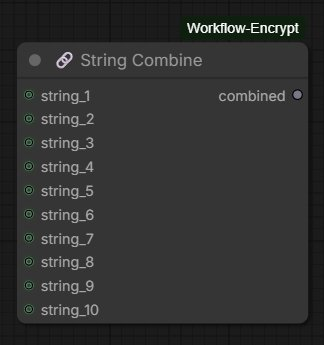

# comfyui-axces2000

Custom ComfyUI nodes by **axces2000** — practical utility nodes for audio handling, image dimensions, text manipulation, and string composition.

---

## Nodes

### 🎵 Audio Loader



Load audio files into your ComfyUI workflow with a full-featured waveform interface.

**Features**

- Drag & drop audio files directly onto the node canvas
- Real-time waveform visualisation with played/unplayed colour coding
- Click or drag anywhere on the waveform to seek
- Play / Pause / Stop transport controls
- Current position and total duration displayed as `HH:MM:SS.mmm`
- Optional normalisation toggle
- Supports MP3, WAV, FLAC, OGG, AAC, M4A, OPUS
- Compatible with ComfyUI's native audio pipeline — output connects directly to `SaveAudio`, `PreviewAudio`, and other audio nodes

**Inputs**

| Name | Type | Description |
|------|------|-------------|
| `normalize` | BOOLEAN | Normalise waveform amplitude to peak 1.0 (default: false) |

**Outputs**

| Name | Type | Description |
|------|------|-------------|
| `audio` | AUDIO | Waveform tensor + sample rate, compatible with native ComfyUI audio nodes |
| `sample_rate` | INT | Sample rate in Hz |
| `duration_seconds` | FLOAT | Duration in seconds |
| `metadata` | STRING | File info: name, sample rate, channels, samples, size |

---

### 📐 Resolution Master



Pick a standard resolution and orientation and get clean width/height integers out — no more mental arithmetic or hardcoded values.

**Features**

- Visual orientation selector with landscape, square, and portrait icons
- Covers SD through 8K with accurate pixel dimensions
- Live preview of output width and height inside the node
- Resolution dropdown with all standard presets

**Resolution table**

|             | SD (480p) | 1K (720p)  | 1.3K (768p) | 2K (1080p) | 2.5K (1440p) | 4K (2160p) | 8K (4320p) |
|-------------|-----------|------------|-------------|------------|--------------|------------|------------|
| Landscape   | 720×480   | 1280×720   | 1344×768    | 1920×1080  | 2560×1440    | 3840×2160  | 7680×4320  |
| Square      | 512×512   | 1024×1024  | 1024×1024   | 1536×1536  | 1920×1920    | 2048×2048  | 5760×5760  |
| Portrait    | 480×720   | 720×1280   | 768×1344    | 1080×1920  | 1440×2560    | 2160×3840  | 4320×7680  |

**Outputs**

| Name | Type | Description |
|------|------|-------------|
| `width` | INT | Output width in pixels |
| `height` | INT | Output height in pixels |
| `resolution_string` | STRING | e.g. `1344x768` |

---

### ✂️ String Extractor



Extract individual lines from a multi-line text block by index, with automatic index advancement for batch workflows.

**Features**

- Multi-line text input (scrollable, supports paste)
- Integer index selector to choose which line to extract
- Live status bar showing current line preview and mode
- Selected line is highlighted in the textarea
- `text` and `index` can optionally be wired from upstream nodes
- Works correctly across scheduled batch runs — state is tracked server-side

**How the index works**

| index value | behaviour |
|-------------|-----------|
| `0` | Full textarea passed to output unchanged |
| `1` to `N` (valid line) | That line is extracted; a trailing space is added if missing |
| Greater than line count | Full textarea passed unchanged; index resets to `0` |

**Mode selector**

| Mode | Behaviour |
|------|-----------|
| `Keep` | Index stays the same after execution |
| `Increment` | Index advances to the next line after each execution; wraps from last line back to `1` |
| `Randomise` | Index is set to a random valid line number after each execution |

The mode selector is disabled when the index is `0` or out of range.

**Inputs**

| Name | Type | Description |
|------|------|-------------|
| `text` | STRING | Multi-line text block (can be wired in or typed directly) |
| `index` | INT | Line to extract, 0 = passthrough (can be wired in or set directly) |
| `mode` | COMBO | Keep / Increment / Randomise |

**Outputs**

| Name | Type | Description |
|------|------|-------------|
| `text_out` | STRING | Extracted line (or full text for index 0 / out of range) |
| `index_out` | INT | Updated index after applying mode |

**Typical workflow pattern**

Connect `index_out` back into `index` to create a self-advancing loop. Set mode to `Increment` and queue multiple runs — each run extracts the next line automatically.

---

### 🔗 String Combine



Concatenate up to 10 string inputs into a single output. All content is preserved exactly — no trimming, no separators added between inputs.

**Features**

- Up to 10 optional string inputs
- Unconnected inputs are silently ignored
- Strings are joined in order (1 through 10) with no modification
- Add separators or spaces in upstream nodes if needed

**Inputs**

| Name | Type | Description |
|------|------|-------------|
| `string_1` … `string_10` | STRING | Optional string inputs to concatenate |

**Outputs**

| Name | Type | Description |
|------|------|-------------|
| `combined` | STRING | All connected strings joined in order |

---

## Installation

### Via ComfyUI Manager (recommended)
Search for **axces2000** in the Custom Nodes section and click Install.

### Manual
```bash
cd ComfyUI/custom_nodes
git clone https://github.com/axces2000/comfyui-axces2000.git
pip install -r comfyui-axces2000/requirements.txt
```
Then restart ComfyUI.

---

## Requirements

- ComfyUI (any recent version)
- `torchaudio` — for Audio Loader
- `soundfile` — fallback audio backend (auto-installed)

---

## File structure

```
comfyui-axces2000/
├── __init__.py
├── requirements.txt
├── pyproject.toml
├── Makefile
├── docs/
│   ├── audio_loader.png
│   ├── resolution_master.png
│   ├── string_extractor.png
│   └── string_combine.png
├── audio_loader/
│   ├── __init__.py
│   ├── audio_loader.py
│   └── js/
│       └── audio_loader.js
├── resolution_master/
│   ├── __init__.py
│   ├── resolution_master.py
│   └── js/
│       └── resolution_master.js
├── string_extractor/
│   ├── __init__.py
│   └── string_extractor.py
├── string_combine/
│   ├── __init__.py
│   └── string_combine.py
└── js/
    ├── audio_loader.js
    ├── resolution_master.js
    └── string_extractor.js
```

---

## License

MIT © axces2000
